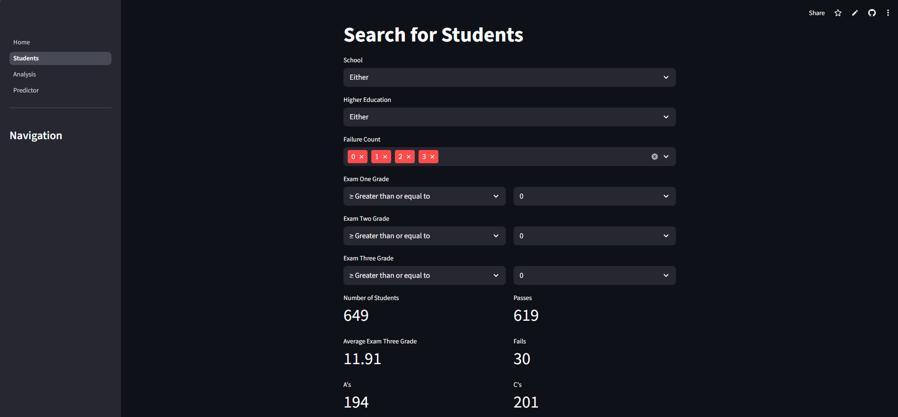
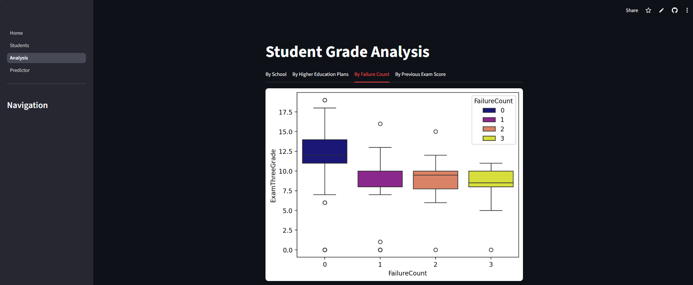
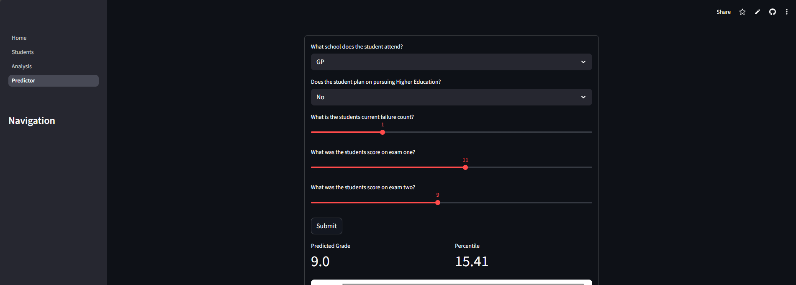

# Project Overview
This project consists of three components: an option to search for specific students, a page where you can view prebuilt charts, and the ability to get final grade predictions for a student. 
The purpose of this project would be for teachers to identify students who are not predicted to achieve well in the final exam before it happens so they are able to take mitigating action in order for the student to achieve higher than they were predicted.

# Database

- Normalised SQLite database to store for analysis and machine learning
- Database was derived from Student Performance Data Set CSV file on Kaggle https://www.kaggle.com/datasets/larsen0966/student-performance-data-set

# Tech Stack 

- Python 
- Streamlit (Dashboard/Web UI)
- Pandas (Data Transformations)
- Seaborn (Advanced Visualisations)
- Matplotlib (Chart formatting)
- Scikit-Learn (Machine Learning)
- Numpy (Numerical Operations)
- PyTest (Testing and Validation)

# Student Search
In this section of the project, you will see a page populated with a series of filters that cause the table, charts and metrics to change dynamically when adjusted.
These filters were selected as the fields the filters apply to have the highest level of influence on the final (exam three) grade, which is the main focus of the project.
These filters allow you to identify the number of students that fall into a certain user-defined category and give you an average grade across the group

# Grade analysis
In this section, you will see a series of different chart types which accurately tell the story of how each field influences the final (exam three) grade of a student. 
The fields featured in this chart were selected due to them being highly correlated to the final grade of a student, making them the most influential. 
The box plots allow you to observe key statistics like median grade, quartiles and smallest and greatest grades across categories, the strip plot allows you to view the grade distribution across categories,
and the bar plots give a visual of how the mean grade varies across categories. Finally, there is a scatter plot with regression lines to allow you to see the correlation each exam grade has on the final grade.

# Student Prediction
This part of the project consists of a form that asks a series of questions to profile a student, which is then input into a simple machine learning model to generate an accurate prediction of
What the student is expected to get on the final exam based on what was entered.
The underlying model characteristics, such as what fields it predicts on, were selected through performing 100 iterations of models with different fields and metrics to then select the best performing one,
the one with the lowest MAE (Mean Absolute Error).
Through performing this experimentation, I found the model predicts more accurately with fewer fields, only selecting the fields with the highest correlation to the Exam Three Grade

# Web Page

- The webpage is hosted on Streamlit Community Cloud so can be viewed on any device without the need of cloning the repository

Link to Webpage: https://appstudentdataplatform-lkrwk98rnpqlqlj2qytwg6.streamlit.app/

